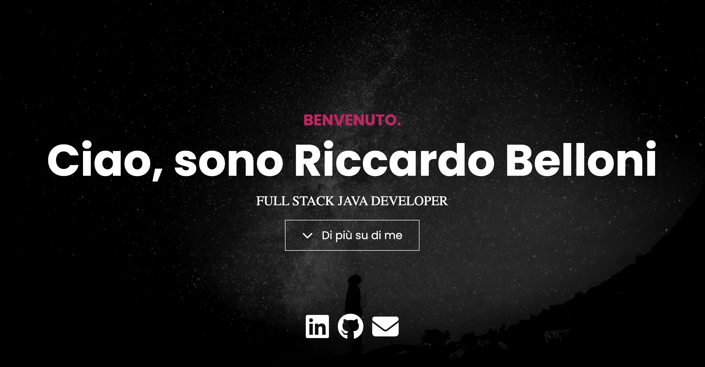

# Portfolio Website

Ciao, questo è il mio portfolio personale



## Caratteristiche

- Responsive design
- Google Fonts
- Effetto Typewriting nell'header
- Modale ricavata da libreria Lightbox
- Icone Font awesome

## Utilizzo

Questo sito è stato realizzato con [Bootstrap](https://getbootstrap.com/) e [Sass](https://sass-lang.com/). Usa [Font Awesome](https://fontawesome.com/) per le icone.
Presente anche [JavaScript](https://developer.mozilla.org/en-US/docs/Web/JavaScript)

Per personalizzare ulteriormente il sito, devi installare[Node.js](https://nodejs.org/en/). Poi, clona questo repository e lancia sul terminale:

```bash
npm install
```

Questo permetterà di installare Bootstrap, Sass e Font Awesome. Per creare il tuo file CSS con Sass, scrivi
sul terminale:

```bash
npm run sass:build
```

Per permettere a Sass di controllare i files per le
modifiche effettuate, scrivi sul terminale:

```bash
npm run sass:watch
```

Puoi aggiungere variabili Bootstrap al file `bootstrap.scss`. Puoi guardare il file `node_modules/bootstrap/dist/scss/_variables.scss` per la lista di tutte le variabili. Non modificare il file `variables.scss` in quanto verrebbero sovvrascrite nel momento in cui aggiorni Bootstrap.

Per personalizzare lo stile, usa il file `styles.scss` .
